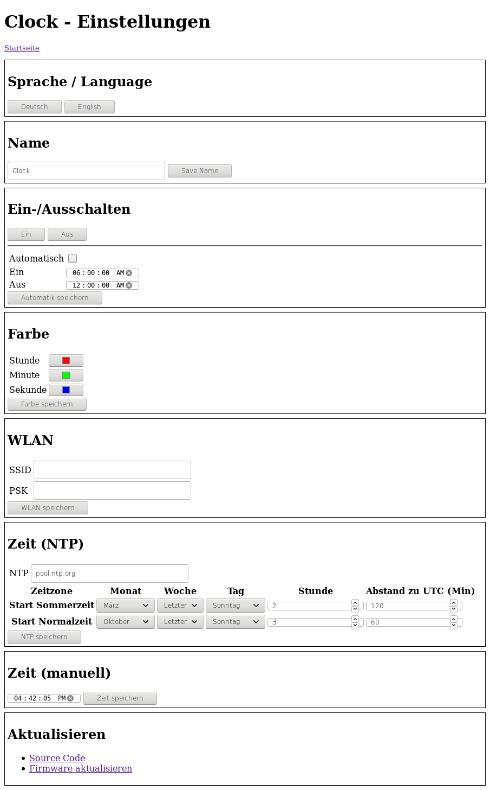

<h1>LED Clock</h1>

Clock with WS2812 LEDs, controlled by a NodeMCU ESP8266 module.

DO NOT EXPOSE THE CLOCK TO THE INTERNET The clock stores your WiFi credentials and supports remote updates

<h2>Features</h2>
<ul>
  <li>Setting color for hour, minute, second</li>
  <li>Brighness control</li>
  <li>Use NTP for time synchronization</li>
  <li>Convert from UTC to local time and DST</li>
  <li>Manual and automatic time triggered On/Off</li>
  <li>Secure HTTPS communication</li>
  <li>OTA update [only with HTTP, connection times out with HTTPS :-( ]</li>
</ul>

<h2>Used Libraries</h2>
<ul>
  <li><a href="https://github.com/esp8266/Arduino">Arduino Core for ESP8266</a></li>
  <li><a href="https://github.com/adafruit/Adafruit_NeoPixel">Adafruit NeoPixel Library</a></li>
</ul>

<h2>Material</h2>
<ul>
  <li>NodeMCU v2</li>
  <li>Buck converter 12V to 5V</li>
  <li>60x WS2812 LEDs on PCB</li>
  <li>Photo resistor 5539</li>
  <li>3D printed housing</li>
  <li>Acryl glass front plate</li>
</ul>

<h2>Setup</h2>
<ol>
  <li>Open the Arduino IDE and load the Clock.ino sketch</li>
  <li>In the Tools menu set the "Flash size" to use SPIFS</li>
  <li>Flash the ESP8266 using Arduino IDE</li>
  <li>
    Connect the NodeMCU with the buck converter, WS2812 LEDs and the photo resistor: 
     
  </li>
</ol>

<h2>Security</h2>

By default the Clock uses https for communication. This can be disabled in Clock.ino (#define HTTPS HTTPS_None), it might be necessary if you want to use OTA updates.

The repository contains a certificate and private key, but you should use your own. To create and upload them:

<ol>
  <li>Run the script "source/make-cert.sh" to create the certificate file "cert.der" and the private key file "key.der". The script requires <a href="https://www.openssl.org/">OpenSSL</a> to be installed.</li>
  <li>Create the directory "source/Clock/data" and copy the generated files into that directory.</li>
  <li>Install the SPIFS tool for Arduino as described in the <a href="https://arduino-esp8266.readthedocs.io/en/latest/filesystem.html#uploading-files-to-file-system">ESP8266 documentation</a>.</li>
  <li>Use the Upload Tool to upload the files to the ESP8266.</li> 
</ol>

<h2>First Start</h2>
<ul>
  <li>Open the Serial Monitor in Arduino IDE</li>
  <li>Power on / reset the Clock</li>
  <li>Connect to Network with SSID = "Clock" and PSK as shown in the Serial Monitor (e.g. "clock-123456")</li>
  <li>Open the web page "https://192.168.4.1"</li>
  <li>On the Settings page enter your WiFi credentials (SSID and PSK) and press "save"</li>
  <li>The clock will now connect to the network, fetch the current time and display it</li>
  <li>At next power on the clock will remember the settings</li>
</ul>
  
<h2>3D Print</h2>

The OpenSCAD file to 3D Print the housing is in the hardware folder. STL files are available at <a href="https://www.thingiverse.com/thing:3130435">Thingiverse</a> 
An alternative to 3D Printing is to use a WS2812 LED ring with 60 LEDs

<h2>UI Screenshots</h2>

