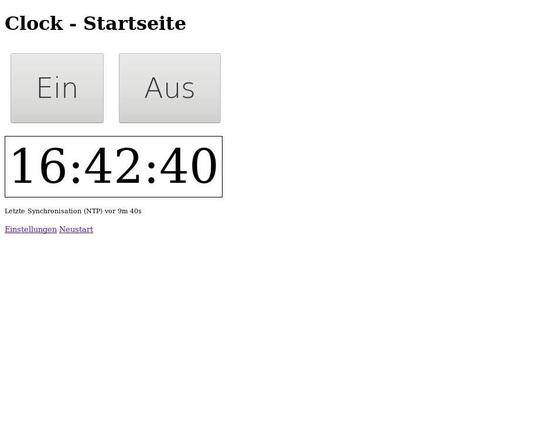

<h1>LED Clock</h1>

Work in progress

Clock with WS2812 LEDs, controlled by an ESP8266.

DO NOT EXPOSE THE CLOCK TO THE INTERNET The clock stores your WiFi credentials and supports remote updates

<h2>Used Libraries</h2>
<ul>
  <li><a href="https://github.com/esp8266/Arduino">Arduino Core for ESP8266</a></li>
  <li><a href="https://github.com/adafruit/Adafruit_NeoPixel">Adafruit NeoPixel Library</a></li>
</ul>

<h2>Features</h2>
<ul>
  <li>Setting color for hour, minute, second</li>
  <li>Using NTP to get the time</li>
  <li>Conversion from UTC to local time and DST</li>
  <li>OTA update</li>
  <li style="color: gray">brighness control (todo)</li>
</ul>

<h2>Setting up the Hardware</h2>
<ul>
  <li>Open the Arduino IDE and load the Clock.ino sketch</li>
  <li>Flash the ESP8266 using Arduino IDE</li>
  <li>Connect ESP8266 pin 12 with WS2812 Din</li>
  <li style="color: gray"> (todo)</li>
</ul>

<h2>First Start</h2>
<ul>
  <li>Open the Serial Monitor in Arduino IDE</li>
  <li>Power on / reset the Clock</li>
  <li>Connect to Network with SSID = "Clock" and PSK as shown in the Serial Monitor (e.g. "clock-123456")</li>
  <li>Open the web page "http://192.168.4.1"</li>
  <li>On the Settings page enter your WiFi credentials (SSID and PSK) and press "save"</li>
  <li>The clock will now connect to the network, fetch the current time and display it</li>
  <li>At next power on the clock will remember the settings</li>
</ul>
  
<h2>Hardware</h2>

STL file at <a href="https://www.thingiverse.com/thing:3130435">Thingiverse</a>

<h2>UI Screenshots</h2>

